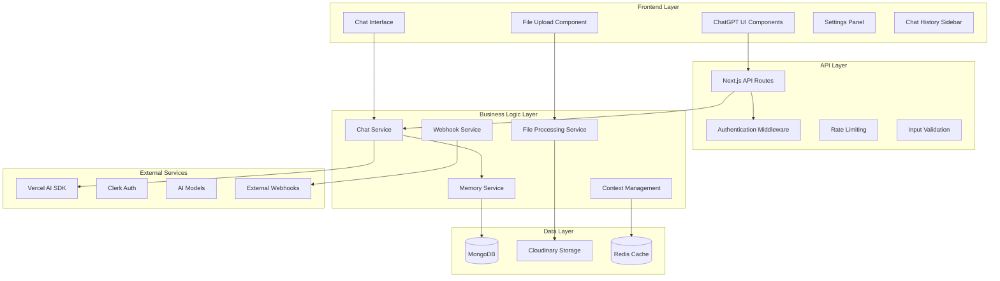
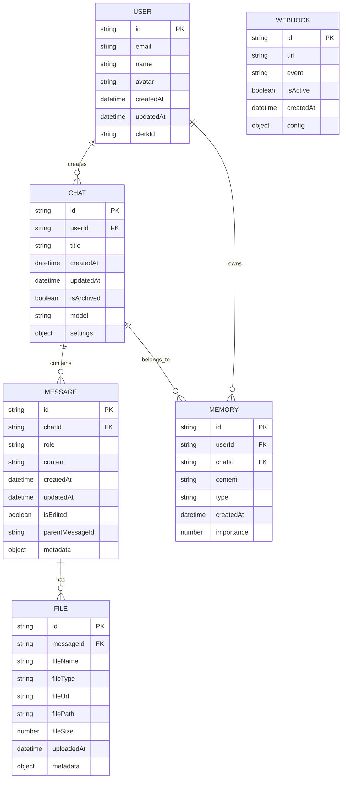
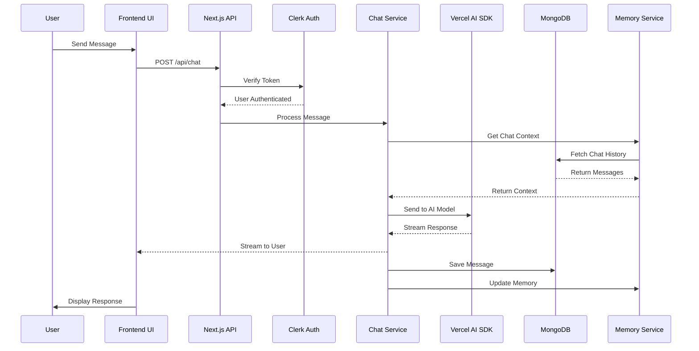
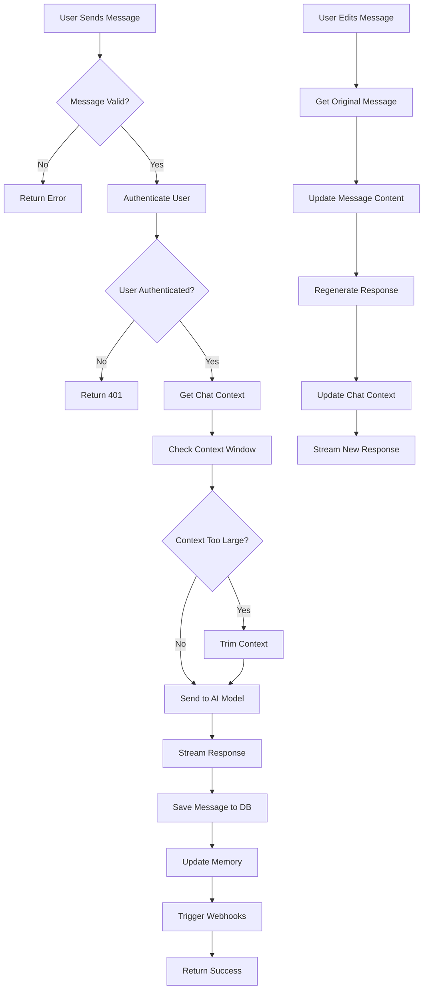
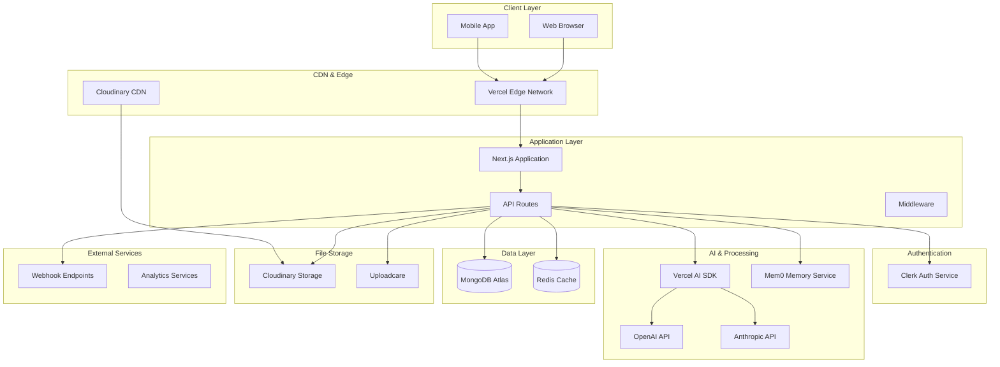

# Galaxy.ai ChatGPT Clone - UML Diagrams & System Design

## 1. Use Case Diagram

```mermaid
graph TB
    User[User] --> UC1[Start New Chat]
    User --> UC2[Send Message]
    User --> UC3[Edit Message]
    User --> UC4[Upload File/Image]
    User --> UC5[View Chat History]
    User --> UC6[Delete Chat]
    User --> UC7[Regenerate Response]
    User --> UC8[Copy Message]
    User --> UC9[Share Chat]
    
    System[ChatGPT Clone System] --> UC10[Process AI Response]
    System --> UC11[Stream Response]
    System --> UC12[Manage Context Window]
    System --> UC13[Store Chat Memory]
    System --> UC14[Handle File Upload]
    System --> UC15[Process File Content]
    System --> UC16[Webhook Integration]
    
    External[External Services] --> UC17[AI Model API]
    External --> UC18[File Storage Service]
    External --> UC19[Authentication Service]
    External --> UC20[Webhook Callbacks]
```



## 2. Component Diagram



## 3. Entity Relationship Diagram (ERD)



## 4. Sequence Diagram - Chat Flow



## 5. Activity Diagram - Message Processing



## 6. System Architecture Diagram



## 7. Database Schema (MongoDB Collections)

### Users Collection
```javascript
{
  _id: ObjectId,
  clerkId: String,
  email: String,
  name: String,
  avatar: String,
  createdAt: Date,
  updatedAt: Date,
  preferences: {
    theme: String,
    language: String,
    model: String
  }
}
```

### Chats Collection
```javascript
{
  _id: ObjectId,
  userId: ObjectId,
  title: String,
  createdAt: Date,
  updatedAt: Date,
  isArchived: Boolean,
  model: String,
  settings: {
    temperature: Number,
    maxTokens: Number,
    systemPrompt: String
  },
  metadata: {
    messageCount: Number,
    lastMessageAt: Date
  }
}
```

### Messages Collection
```javascript
{
  _id: ObjectId,
  chatId: ObjectId,
  role: String, // 'user' | 'assistant' | 'system'
  content: String,
  createdAt: Date,
  updatedAt: Date,
  isEdited: Boolean,
  parentMessageId: ObjectId,
  metadata: {
    tokens: Number,
    model: String,
    finishReason: String
  },
  files: [{
    id: String,
    name: String,
    type: String,
    url: String
  }]
}
```

### Files Collection
```javascript
{
  _id: ObjectId,
  messageId: ObjectId,
  fileName: String,
  fileType: String,
  fileUrl: String,
  filePath: String,
  fileSize: Number,
  uploadedAt: Date,
  metadata: {
    width: Number,
    height: Number,
    duration: Number
  }
}
```

### Memories Collection
```javascript
{
  _id: ObjectId,
  userId: ObjectId,
  chatId: ObjectId,
  content: String,
  type: String, // 'fact' | 'preference' | 'context'
  createdAt: Date,
  importance: Number,
  tags: [String]
}
```

## 8. High-Level Architecture Explanation

### System Overview
The Galaxy.ai ChatGPT Clone is a full-stack Next.js application that replicates ChatGPT's functionality with pixel-perfect UI/UX. The system is built with a microservices-oriented architecture using Next.js API routes, MongoDB for data persistence, and Vercel AI SDK for AI model integration.

### Key Components

**Frontend Layer:**
- React components built with TypeScript and TailwindCSS
- Pixel-perfect ChatGPT UI replication using v0.dev
- Real-time message streaming with graceful UI updates
- File upload components with drag-and-drop support
- Responsive design for mobile and desktop

**API Layer:**
- Next.js API routes handling authentication, chat, and file operations
- Middleware for rate limiting, validation, and security
- Webhook support for external service integration
- Context window management for long conversations

**Data Layer:**
- MongoDB for persistent storage of chats, messages, and user data
- Redis for caching and session management
- Cloudinary for secure file storage and CDN delivery
- Mem0 for intelligent conversation memory management

**AI Integration:**
- Vercel AI SDK for seamless AI model integration
- Support for multiple AI providers (OpenAI, Anthropic)
- Streaming responses with real-time UI updates
- Context window optimization for long conversations

**Security & Performance:**
- Clerk authentication with JWT tokens
- Rate limiting and input validation
- File type validation and virus scanning
- CDN optimization for global performance

### Deployment Strategy
- Vercel for hosting and edge deployment
- MongoDB Atlas for managed database
- Cloudinary for media optimization
- Environment-based configuration for different stages
